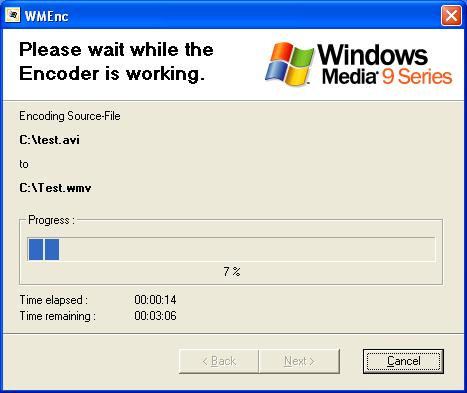

## How to use the Windows Media Encoder SDK

### Description

Shows how to control the Windows Media Encoder SDK through Code, not like the other submissions on this Site through a Batch-File or something like that. Encodes a given Video-File by using a Profile from the Windows Media Encoder which you choose (or you can also create an ew Profile through the Profile Manager).

NOTE THAT THIS REQUIRES THE WINDOWS MEDIA ENCODER 9 TO BE INSTALLED !!! This can be downloaded from the Microsoft-Website !

Credits go to Steve McMahon for his Progressbar, and two people whose names i cannot remember, for the "Progressbar Remaining Time" - Module and the Common Dialog API, so if you recognize your code, please post in the comments so I can give you your well deserved Credit !
 
### More Info
 

             |
---                |---
**Submitted On**   |2004-06-02 22:45:16
**By**             |[Thomas Sturm](https://github.com/Planet-Source-Code/PSCIndex/blob/master/ByAuthor/thomas-sturm.md)
**Level**          |Advanced
**User Rating**    |4.8 (19 globes from 4 users)
**Compatibility**  |VB 6\.0
**Category**       |[Complete Applications](https://github.com/Planet-Source-Code/PSCIndex/blob/master/ByCategory/complete-applications__1-27.md)
**World**          |[Visual Basic](https://github.com/Planet-Source-Code/PSCIndex/blob/master/ByWorld/visual-basic.md)
**Archive File**   |[How\_to\_use175374642004\.zip](https://github.com/Planet-Source-Code/thomas-sturm-how-to-use-the-windows-media-encoder-sdk__1-54181/archive/master.zip)

